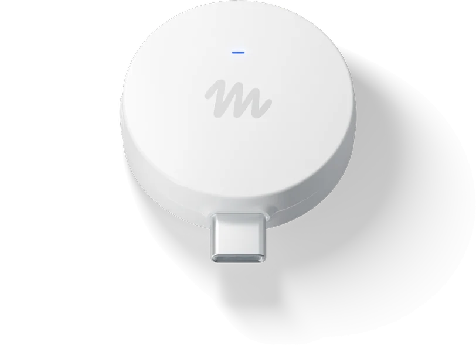
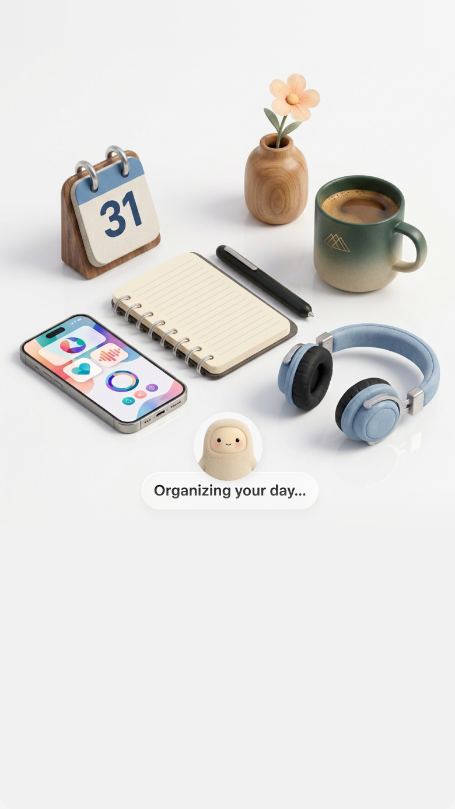

# Facebook Aura (Meta Muse) 原生多媒体与视觉资产全景图库

本目录归档从 Facebook Aura (`com.facebook.aura`, Meta Muse) 原生官方 Release APK (`9.0.0.23.178`) 中逆向反查并精准提取的全部多媒体与交互资产。涵盖 **Muse 角色立绘状态集**、**官方品牌与高精插画**、**Library 资产库全套 28 枚系统文件图标**、**连接器与生态品牌图标**、**UI 交互反馈控件**、**Lottie 矢量动效**、**语音通话原版与 Web 兼容音效** 以及**内置工件 Web 预览器**。

所有图像资源均采用标准 Markdown 语法直接内联渲染，供 `/visual-verdict` 技能作为 390px Mobile-First React 高保真还原的直接视觉与资源基准。

---

## 1. Muse 智能体核心角色立绘（Character Avatars）

智能体 Muse 具备多套针对不同运行状态、昼夜模式及硬件终端定制的官方高精度立绘。

| 视觉呈现 | 素材文件 | 分辨率 / 格式 | 交互状态与应用场景 |
|:---:|---|---|---|
|  | `character_avatars/aura_bot_body.webp` | 480 × 480 (WebP) | **日间默认待机态**：用户开启日间浅色模式下的主对话界面核心形象，柔和青白渐变立体球体。 |
|  | `character_avatars/aura_bot_body_night.webp` | 480 × 480 (WebP) | **夜间深色模式态**：深色/暗黑主题下的待机形态，采用深黑蓝底色与荧光青色眼部交互。 |
|  | `character_avatars/aura_bot_working.webp` | 480 × 480 (WebP) | **思考生成/任务执行态**：Agent 正在调取外部工具、联网检索或生成回答时的动态发光高亮形态。 |
|  | `character_avatars/hatch_wearables_jollybot.png` | 144 × 144 (PNG) | **可穿戴硬件连接态**：智能穿戴设备（如智能眼镜、手表）与 Agent 建立低功耗蓝牙配对时的专属机器人头雕。 |

---

## 2. 官方品牌标识与裂变大插画（Branding & Illustrations）

包含 Meta 官方设计语言标识、主页宣传封面以及邀请裂变机制的高精度插画资产。

| 视觉呈现 | 素材文件 | 尺寸 / 格式 | 用途与设计规范 |
|:---:|---|---|---|
|  | `branding_and_illustrations/muse_wordmark.png` | 240 × 58 (PNG) | **Muse 官方字体标（Wordmark）**：冷启动 Splash 屏幕与主页顶部导航居中品牌标识。 |
|  | `branding_and_illustrations/meta_ai_icon.png` | 128 × 128 (PNG) | **Meta AI 官方渐变光环**：用于对话生成底部背书、关于页面与 Meta 生态连接标志。 |
|  | `branding_and_illustrations/hatch_from_meta.png` | 320 × 64 (PNG) | **"from Meta" 归属标**：启动页与登录鉴权页底部正规官方归属展示。 |
|  | `branding_and_illustrations/muse_home_link.webp` | 640 × 360 (WebP) | **Muse 官网主页链接卡片**：系统设置与帮助中心引导卡片封面图。 |
|  | `branding_and_illustrations/hatch_invite_gift_illustration.webp` | 720 × 720 (WebP) | **邀请好友礼盒插画**：Invite 裂变半屏抽屉顶部核心大插画，带有精致立体光影。 |
|  | `branding_and_illustrations/hatch_invite_reward_coins_illustration.webp` | 600 × 400 (WebP) | **10 亿 Token 金币奖励插画**：邀请码兑现成功或算力空投提示弹窗核心视觉。 |
|  | `branding_and_illustrations/hatch_invite_story_background.png` | 1080 × 1920 (PNG) | **裂变分享全屏背景图**：用于一键生成并分享至 Instagram/Facebook Stories 的高清竖屏背景底图。 |

---

## 3. Library 资产库系统文件类型图标集（28 枚 40×40 PNG）

Facebook Aura 为自主 Agent 生成的各类 Artifacts 工件与底层虚拟文件系统（`memory/`、`dreams/`、`config/`）设计了专用的极简文件图标族，用于 Library Tab 资产库列表与代码查看器。

| 预览 | 文件名 | 格式 | 语义映射 / 业务含义 |
|:---:|---|---|---|
|  | `hatch_file_types_folder_40.png` | 40×40 PNG | 目录/文件夹（闭合态） |
|  | `hatch_file_types_folderopen_40.png` | 40×40 PNG | 目录/文件夹（展开态） |
|  | `hatch_file_types_markdown_40.png` | 40×40 PNG | Markdown 记忆文件（`.md`，智能体每日记忆） |
|  | `hatch_file_types_agentic_40.png` | 40×40 PNG | 智能体自主工作流工件（Agentic Task） |
|  | `hatch_file_types_artifact_40.png` | 40×40 PNG | 基础工件产物（Generic Artifact） |
|  | `hatch_file_types_buildartifact_40.png` | 40×40 PNG | 构建产物 / 运行包工件 |
|  | `hatch_file_types_code_40.png` | 40×40 PNG | 代码文件（TypeScript / Python / Java 等） |
|  | `hatch_file_types_document_40.png` | 40×40 PNG | 纯文本与通用文档 |
|  | `hatch_file_types_documentsearch_40.png` | 40×40 PNG | RAG 检索命中与知识库索引文档 |
|  | `hatch_file_types_worddocument_40.png` | 40×40 PNG | Word 文档（`.docx` / `.doc`） |
|  | `hatch_file_types_excelspreadsheet_40.png` | 40×40 PNG | Excel / 电子表格（`.xlsx` / `.csv`） |
|  | `hatch_file_types_powerpoint_40.png` | 40×40 PNG | PowerPoint 幻灯片（`.pptx`） |
|  | `hatch_file_types_googleslides_40.png` | 40×40 PNG | Google Slides 在线幻灯片 |
|  | `hatch_file_types_pdf_40.png` | 40×40 PNG | PDF 格式文件 |
|  | `hatch_file_types_html_40.png` | 40×40 PNG | HTML 网页 / Web 应用产物 |
|  | `hatch_file_types_git_40.png` | 40×40 PNG | Git 仓库工件 / 版本提交分支 |
|  | `hatch_file_types_audio_40.png` | 40×40 PNG | 音频录音与语音通话素材 |
|  | `hatch_file_types_videofallback_40.png` | 40×40 PNG | 视频文件 / 多媒体录屏 |
|  | `hatch_file_types_imagefallback_40.png` | 40×40 PNG | 图片素材（JPG / PNG / WebP） |
|  | `hatch_file_types_zip_40.png` | 40×40 PNG | 压缩包归档（`.zip` / `.tar.gz`） |
|  | `hatch_file_types_calendar_40.png` | 40×40 PNG | 日历事件工件 / 日程邀约 |
|  | `hatch_file_types_clock_40.png` | 40×40 PNG | 定时任务 / 周期 Cron 触发器 |
|  | `hatch_file_types_todo_40.png` | 40×40 PNG | 待办待核销工件（Todo Item） |
|  | `hatch_file_types_check_40.png` | 40×40 PNG | 已完成任务核销凭据 |
|  | `hatch_file_types_emailsent_40.png` | 40×40 PNG | Agent 自动代发邮件成功凭据 |
|  | `hatch_file_types_message_40.png` | 40×40 PNG | 消息交互历史片段 |
|  | `hatch_file_types_shield_40.png` | 40×40 PNG | 安全审计日志 / 风险预警工件 |
|  | `hatch_file_types_heart_40.png` | 40×40 PNG | 收藏/喜爱项归档 |

---

## 4. 连接器、支付与第三方渠道品牌图标（Connectors & Brands）

用于模块十一（Connectors Hub）中数据连接器列表、智能体钱包绑定与渠道消息同步。

| 预览 | 文件名 | 尺寸 | 业务映射与场景 |
|:---:|---|---|---|
|  | `hatch_connector_shoppay.png` | 48×48 PNG | **Shop Pay 支付连接器**：智能体自主交易绑定的快捷支付钱包。 |
|  | `hatch_connector_stripe.png` | 48×48 PNG | **Link by Stripe 钱包**：银行卡托管与代付连接器。 |
|  | `health_connect_icon.webp` | 96×96 WebP | **Google Health Connect**：健康与运动生理数据连接器。 |
|  | `hatch_connector_genericcal.png` | 48×48 PNG | **通用系统日历连接器**：读取本地系统日程安排。 |
|  | `hatch_connector_genericchat.png` | 48×48 PNG | **即时聊天通道连接器**：外部聊天应用通信桥梁。 |
|  | `hatch_connector_genericphone.png` | 48×48 PNG | **系统电话与通话记录连接器**：Call Log 权限挂载。 |
|  | `hatch_connector_genericnotifs.png` | 48×48 PNG | **系统通知读取连接器**：实时捕获通知栏消息。 |
|  | `facebook_logo_round.png` | 64×64 PNG | **Facebook 圆标**：FB 快捷登录与故事分享。 |
|  | `instagram_logo_round.png` | 64×64 PNG | **Instagram 圆标**：快拍分享与跨应用联动。 |

---

## 5. 通用 UI 控件与反馈状态图标（UI Controls & Feedback）

用于页面各模块按钮状态、任务核销打勾、点赞反馈及密码显隐。

| 预览 | 文件名 | 尺寸 | 交互功能与用途 |
|:---:|---|---|---|
|  | `check_circle_checked.png` | 48×48 PNG | **已勾选复选框**：Goals 任务打勾核销、多选选中态。 |
|  | `check_circle_unchecked.png` | 48×48 PNG | **未勾选复选框**：Goals 待办待核销空圈。 |
|  | `facebook_thumbs_up.png` | 48×48 PNG | **点赞手势图标**：AI 回答气泡底部点赞反馈。 |
|  | `hatch_heart.png` | 48×48 PNG | **红心图标**：Feed 流资讯卡片喜欢/收藏按钮。 |
|  | `aura_gating_lock.png` | 64×64 PNG | **权限访问控制锁**：Waitlist 排队锁或受限功能提示。 |
|  | `aura_graduation_cap.png` | 64×64 PNG | **新手引导学士帽**：引导模式（Onboarding Walkthrough）专属标记。 |
|  | `aura_icon_eye.png` | 48×48 PNG | **密码显隐小眼睛**：凭据安全库输入密码时的明密文切换。 |
|  | `aura_icon_code.png` | 48×48 PNG | **代码模式图标**：Artifact 预览中的 Source Code 视图切换。 |
|  | `spinner_large.png` | 64×64 PNG | **大号 Loading 转轮**：全屏加载或页面切换等待轮盘。 |

---

## 6. Lottie 矢量动效与音频技术参数

### 01. Lottie 动画文件参数表
| 动画文件（JSON） | 用途场景 | 帧数 | 原生尺寸 | 推荐播放速率与模式 |
|---|---|---|---|---|
| `animations_lottie/hatch_logo_intro.json` | 应用冷启动 Splash 动画、AI 唤醒时刻 | 81 帧 | 100 × 100 | 1.0x (单次播放) |
| `animations_lottie/hatch_logo_outro.json` | 对话流加载完成、Logo 收起过渡态 | 31 帧 | 100 × 100 | 1.0x (单次播放) |
| `animations_lottie/hatch_ptr_loader.json` | 页面顶部下拉刷新（Pull to Refresh） | 360 帧 | 100 × 100 | 1.2x (无限循环) |
| `animations_lottie/hatch_loading_gesture.json` | 任务执行中等待、AI 思考呼吸手势 | 360 帧 | 100 × 100 | 1.0x (无限循环) |

### 02. 语音交互音频文件（Sound Effects）
- **编码格式**：APK 原始提取 `Opus` (48000 Hz, 双声道, 64 kbps) + 现已转录生成的无损 `WAV` (1536 kbps) 与标准 Web `MP3` (142 kbps)。
- **音频清单**：
  - `audio_sound_effects/hatch_voice_call_start.[mp3|opus|wav]`：语音通话接通/唤醒提示音（双频上扬清脆和弦，时长 ~0.4s）。
  - `audio_sound_effects/hatch_voice_call_end.[mp3|opus|wav]`：语音挂断/结束提示音（柔和下降收尾音，时长 ~0.4s）。

---

## 7. Meta 官方设计字体族（Fonts & Typography）

| 字体文件 | 字体名称 | 格式特性 | 应用规范 |
|---|---|---|---|
| `fonts_typography/optimistic_ai_vf.ttf` | **Optimistic AI Variable** | TTF 可变字体 | Meta AI 专属定制排版字体，支持粗细自由轴调整。 |
| `fonts_typography/optimistic_vf.ttf` | **Optimistic Variable** | TTF 可变字体 | Meta 官方主设计语言可变字体，用于全应用正文与主标题。 |
| `fonts_typography/Optimistic_A_Bold.ttf` | **Optimistic A Bold** | TTF 粗体 | 静态粗体，用于标题 `text-lg font-bold`。 |
| `fonts_typography/Optimistic_A_Medium.ttf` | **Optimistic A Medium** | TTF 中黑体 | 静态中等粗细，用于导航栏与重要按钮标签。 |
| `fonts_typography/Optimistic_A_Regular.ttf` | **Optimistic A Regular** | TTF 常规体 | 静态常规正文。 |
| `fonts_typography/roboto_mono_vf.ttf` | **Roboto Mono Variable** | TTF 等宽可变 | 代码块、日志、时间戳及等宽数字输入框。 |
| `fonts_typography/caveat_wght.ttf` | **Caveat** | TTF 手写体 | 智能体个性化手写便签与手绘风格提示卡片。 |

---

## 8. 内置工件 Web 预览引擎（Web Viewers）

APK 内部预置了针对不同复杂工件的轻量离线 Web 渲染容器，存放在 `web_viewers/`：

1. **`docxviewer/`**：包含 `docx-preview.min.js`，支持在 WebView 内高质量解析并排版渲染 Word 文档。
2. **`pptxviewer/`**：基于 `pptxjs` 与 `d3` 的幻灯片播放容器，支持移动端手势滑动切页。
3. **`sheetviewer/`**：基于 `xlsx.full.min.js` 的电子表格查看器，支持多 Sheet 标签切换与表格缩放。
4. **`vmvnc/`**：集成 `noVNC (rfb.js)` 虚拟桌面与浏览器操作查看器，用于 Agent 远程操控虚拟环境时的实时画面回传。

---

## 9. 在 React (390px Mobile-First) 中的集成示例代码

### 01. 引入 Lottie 动效组件
```tsx
import React from 'react';
import Lottie from 'lottie-react';
import loadingGestureAnim from '@/extracted_assets/animations_lottie/hatch_loading_gesture.json';
import ptrLoaderAnim from '@/extracted_assets/animations_lottie/hatch_ptr_loader.json';

// AI 思考状态下的动态呼吸手势
export function MuseThinkingIndicator() {
  return (
    <div className="w-10 h-10 flex items-center justify-center">
      <Lottie
        animationData={loadingGestureAnim}
        loop={true}
        autoplay={true}
        className="w-full h-full"
      />
    </div>
  );
}

// 下拉刷新指示器
export function MusePullToRefreshLoader() {
  return (
    <div className="w-8 h-8 mx-auto py-2">
      <Lottie
        animationData={ptrLoaderAnim}
        loop={true}
        autoplay={true}
      />
    </div>
  );
}
```

### 02. 播放语音提示音效 (HTML5 Audio)
```ts
// 唤起语音会话或挂断提示音
export function playVoiceTone(action: 'start' | 'end') {
  const src = action === 'start'
    ? '/extracted_assets/audio_sound_effects/hatch_voice_call_start.mp3'
    : '/extracted_assets/audio_sound_effects/hatch_voice_call_end.mp3';
  
  const audio = new Audio(src);
  audio.volume = 0.85;
  audio.play().catch((err) => {
    // 捕获移动端浏览器首势未激活策略拦截
    console.debug('Audio autoplay suppressed:', err);
  });
}
```

### 03. 角色形象与状态切换组件
```tsx
import React from 'react';

interface MuseAvatarProps {
  status: 'idle' | 'working';
  darkMode?: boolean;
}

export function MuseAvatar({ status, darkMode = false }: MuseAvatarProps) {
  const avatarSrc = status === 'working'
    ? '/extracted_assets/character_avatars/aura_bot_working.webp'
    : darkMode
      ? '/extracted_assets/character_avatars/aura_bot_body_night.webp'
      : '/extracted_assets/character_avatars/aura_bot_body.webp';

  return (
    <div className="relative w-14 h-14 rounded-full overflow-hidden flex items-center justify-center bg-transparent">
      
    </div>
  );
}
```
